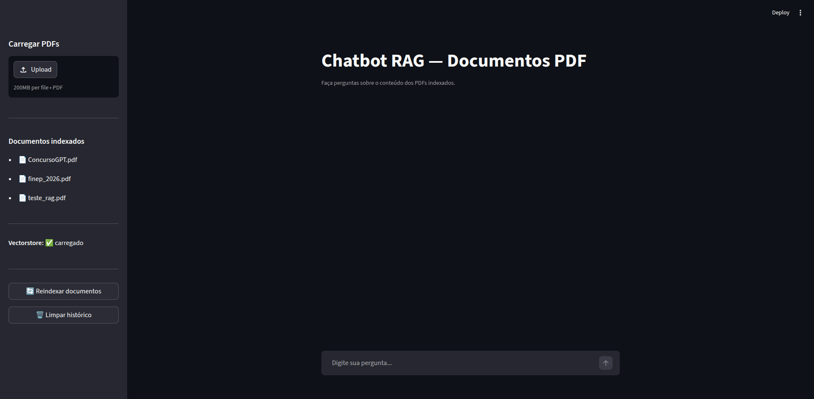

# Chatbot RAG — Documentos PDF

Chatbot conversacional com **Retrieval-Augmented Generation (RAG)** que responde perguntas em linguagem natural sobre o conteúdo de documentos PDF. Interface web com Streamlit, embeddings semânticos com ChromaDB e geração de respostas via GPT-4o-mini.



---

## Stack tecnológico

| Camada | Tecnologia |
| --- | --- |
| Linguagem | Python 3.11+ |
| Interface web | Streamlit |
| Orquestração LLM | LangChain (LCEL) |
| Modelo de linguagem | OpenAI `gpt-4o-mini` |
| Embeddings | OpenAI `text-embedding-3-small` |
| Vector store | ChromaDB (persistido localmente) |
| Carregamento de PDFs | PyPDF via LangChain |
| Variáveis de ambiente | python-dotenv |

---

## Estrutura do projeto

```text
chatbot-rag-pdf/
├── app/
│   ├── interface.py     # Interface web Streamlit (ponto de entrada principal)
│   ├── main.py          # Fallback CLI (linha de comando)
│   ├── chatbot.py       # Chain RAG: retriever → prompt → LLM → parser
│   ├── embeddings.py    # Criação e reutilização do vectorstore ChromaDB
│   └── pdf_loader.py    # Carregamento, chunking, validação e filtragem de PDFs
├── data/                # PDFs de entrada (não versionados, criados automaticamente)
├── vector_store/        # Índice vetorial persistido (não versionado)
├── tests/
│   ├── conftest.py      # Fixture autouse: OPENAI_API_KEY=fake
│   └── test_chatbot.py  # 19 testes unitários com mocks
├── docs/                # Documentação de decisões técnicas e screenshots
├── Makefile             # Atalhos: install, run, test
├── .env.example
├── requirements.txt
└── README.md
```

---

## Instalação

### Pré-requisitos

- Python **3.11 ou superior** (verifique com `python3 --version`)
- Chave de API da OpenAI — obtenha em [platform.openai.com/api-keys](https://platform.openai.com/api-keys)

### Passo a passo

```bash
# 1. Clonar o repositório
git clone https://github.com/lgpsouza/chatbot-rag-pdf.git
cd chatbot-rag-pdf

# 2. Criar ambiente virtual, instalar dependências (via Makefile)
make install

# 3. Configurar variável de ambiente
cp .env.example .env
```

Edite `.env` e substitua pelo valor real da sua chave:

```env
OPENAI_API_KEY=sk-proj-sua-chave-aqui
```

> **Custo estimado de embeddings:** aproximadamente US$ 0,02 por 1 MB de texto extraído de PDF usando `text-embedding-3-small`. O índice é reutilizado nas execuções seguintes sem custo adicional.

#### Instalação manual (sem Makefile)

```bash
python3 -m venv .venv
source .venv/bin/activate      # Linux/macOS
.venv\Scripts\activate         # Windows
pip install -r requirements.txt
```

---

## Execução

```bash
make run
```

Acesse `http://localhost:8501` no navegador. Se a porta 8501 já estiver em uso, o Streamlit usa a próxima disponível (ex.: 8502) — a URL correta é exibida no terminal.

> **Alternativa via terminal:** `python app/main.py`

---

## Como usar

### 1. Carregar PDFs

Use o painel lateral **"Carregar PDFs"** para fazer upload de um ou mais arquivos `.pdf`.

- Limite por arquivo: **50 MB**
- PDFs inválidos (corrompidos ou sem texto selecionável, como scans sem OCR) são **rejeitados automaticamente** com aviso explicativo
- Os arquivos válidos são salvos em `data/`

### 2. Reindexar documentos

Clique em **"🔄 Reindexar documentos"** — o botão aparece em **vermelho** sempre que há PDFs novos sem vectorstore correspondente.

O que acontece ao clicar:

1. A coleção existente no ChromaDB é limpa (`delete_collection`)
2. Os PDFs são divididos em chunks de 1.000 caracteres (overlap de 200)
3. Embeddings semânticos são gerados via OpenAI API
4. O índice é persistido em `vector_store/` com um manifest de hashes MD5
5. Nas próximas execuções, o índice é reutilizado **sem custo** se nenhum PDF mudou

> O tempo varia com o tamanho dos documentos. PDFs de ~500 KB levam cerca de 10–30 segundos.

### 3. Fazer perguntas

Digite perguntas no campo de texto. O chatbot responde **exclusivamente** com base no conteúdo dos PDFs indexados — não inventa informações.

```text
Você:  Qual é o prazo de entrega descrito no contrato?
Bot:   Conforme a cláusula 4.2 do contrato, o prazo de entrega é de 30 dias corridos...

Você:  Quais são os requisitos técnicos do sistema?
Bot:   Os requisitos técnicos listados no documento incluem...

Você:  Qual é a capital da França?
Bot:   Não encontrei informações sobre isso nos documentos fornecidos.
```

> **Sessão:** o histórico de conversa existe apenas enquanto o browser está aberto. Recarregar a página ou clicar em **"🗑️ Limpar histórico"** apaga as mensagens.

---

## Arquitetura

O fluxo de dados segue dois caminhos principais:

**Indexação (uma vez por conjunto de PDFs):**
`Upload PDF → data/ → pdf_loader (chunks) → OpenAI Embeddings → ChromaDB (vector_store/)`

**Consulta (a cada pergunta):**
`Pergunta → ChromaDB retriever (top-k chunks) → Prompt → gpt-4o-mini → Resposta`


---

## Testes

```bash
make test

# Com relatório de cobertura
.venv/bin/pytest tests/ -v --cov=app --cov-report=term-missing
```

**19 testes, todos passando. Nenhum faz chamada real à API OpenAI.**

| Módulo | Cobertura |
| --- | --- |
| `pdf_loader.py` | 100% |
| `embeddings.py` | 100% |
| `chatbot.py` | 94% |

Cenários cobertos: diretório vazio, PDF válido, PDF de imagem sem texto (warning), PDF corrompido, vectorstore reutilizado (hash igual), vectorstore reconstruído (hash divergente), aviso de custo de embeddings, vectorstore vazio, erro de permissão de escrita, sanitização de path traversal no upload, ausência de API key, resposta válida, contexto insuficiente, entrada vazia, entrada muito longa, `RateLimitError`, `APIError`, `APITimeoutError`.

---

## Troubleshooting

| Sintoma | Causa provável | Solução |
| --- | --- | --- |
| `OPENAI_API_KEY não definida` | `.env` não criado ou chave em branco | `cp .env.example .env` e preencha a chave |
| `Nenhum documento encontrado` | Nenhum PDF válido em `data/` | Faça upload pela interface e clique em Reindexar |
| Vectorstore `⚠️ não inicializado` após upload | Falta clicar em Reindexar | Clique no botão vermelho **"🔄 Reindexar documentos"** |
| PDF rejeitado com aviso | Arquivo corrompido ou scan sem OCR | Use um PDF com texto selecionável |
| Porta 8501 ocupada | Outra instância do Streamlit rodando | `pkill -f "streamlit run"` e rode novamente |
| Resposta lenta ou timeout | Latência da API OpenAI | Aguarde e tente novamente; verifique status em [status.openai.com](https://status.openai.com) |

---

## Limitações

- PDFs baseados em imagem (scans sem OCR) não são suportados — apenas texto extraível é indexado
- Sem suporte a DOCX, HTML ou outros formatos além de PDF
- Sem autenticação de usuários
- Sem histórico persistido entre sessões

---

## Roadmap

### v0.1 — MVP ✅

- [x] Carregamento e chunking de PDFs com filtragem de chunks vazios
- [x] Geração e persistência de embeddings com ChromaDB
- [x] Chain RAG com LangChain LCEL + GPT-4o-mini
- [x] Interface web Streamlit com histórico de sessão
- [x] Upload de PDFs e reindexação via interface
- [x] Tratamento de erros de API (`RateLimitError`, `APIError`, `APITimeoutError`)
- [x] Suite de testes unitários com mocks (19 testes, 100% nos módulos de negócio)

### v0.2 — Qualidade ✅

- [x] Invalidação seletiva do vectorstore por hash de arquivo (manifest JSON com MD5)
- [x] Limite de tamanho no upload de PDFs (50 MB)
- [x] Proteção contra path traversal no nome do arquivo enviado
- [x] Validação de PDFs no upload com remoção automática de inválidos
- [x] Correção de SQLITE_READONLY_DBMOVED no Reindexar (ChromaDB singleton)
- [x] Makefile com targets `install`, `run` e `test`

### v0.3 — Produção

- [ ] Histórico de conversa persistido entre sessões
- [ ] Containerização com Docker
- [ ] Pipeline CI com GitHub Actions
