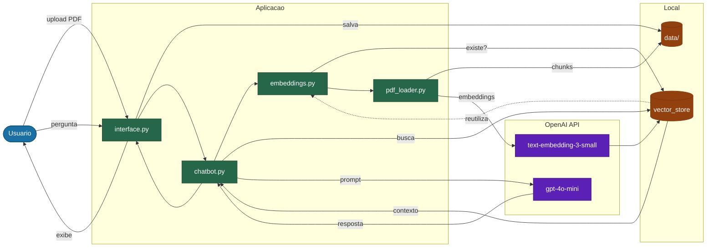

# Chatbot RAG — Documentos PDF

Chatbot conversacional com **Retrieval-Augmented Generation (RAG)** que responde perguntas em linguagem natural sobre o conteúdo de documentos PDF. Interface web com Streamlit, embeddings semânticos com ChromaDB e geração de respostas via GPT-4o-mini.

---

## Stack tecnológico

| Camada | Tecnologia |
| --- | --- |
| Linguagem | Python 3.11+ |
| Interface web | Streamlit |
| Orquestração LLM | LangChain (LCEL) |
| Modelo de linguagem | OpenAI `gpt-4o-mini` |
| Embeddings | OpenAI `text-embedding-3-small` |
| Vector store | ChromaDB (persistido localmente) |
| Carregamento de PDFs | PyPDF via LangChain |
| Variáveis de ambiente | python-dotenv |

---

## Estrutura do projeto

```text
chatbot-rag-pdf/
├── app/
│   ├── interface.py     # Interface web Streamlit (ponto de entrada principal)
│   ├── main.py          # Fallback CLI (linha de comando)
│   ├── chatbot.py       # Chain RAG: retriever → prompt → LLM → parser
│   ├── embeddings.py    # Criação e reutilização do vectorstore ChromaDB
│   └── pdf_loader.py    # Carregamento, chunking e filtragem de PDFs
├── data/                # PDFs de entrada (não versionados)
├── vector_store/        # Índice vetorial persistido (não versionado)
├── tests/
│   ├── conftest.py      # Fixture autouse: OPENAI_API_KEY=fake
│   └── test_chatbot.py  # 16 testes unitários com mocks
├── docs/                # Documentação de decisões técnicas
├── .env.example
├── requirements.txt
└── README.md
```

---

## Instalação

### 1. Clonar o repositório

```bash
git clone https://github.com/lgpsouza/chatbot-rag-pdf.git
cd chatbot-rag-pdf
```

### 2. Criar e ativar ambiente virtual

```bash
python3 -m venv .venv
source .venv/bin/activate      # Linux/macOS
.venv\Scripts\activate         # Windows
```

### 3. Instalar dependências

```bash
pip install -r requirements.txt
```

### 4. Configurar variável de ambiente

```bash
cp .env.example .env
```

Edite `.env` e preencha com sua chave da OpenAI:

```env
OPENAI_API_KEY=sk-proj-...
```

> Obtenha sua chave em [platform.openai.com/api-keys](https://platform.openai.com/api-keys).

---

## Execução

```bash
streamlit run app/interface.py
```

Acesse `http://localhost:8501` no navegador.

> Alternativa via terminal: `python app/main.py`

---

## Como usar

### 1. Carregar PDFs

Use o painel lateral **"Carregar PDFs"** para fazer upload de um ou mais arquivos `.pdf`. Os arquivos são salvos automaticamente na pasta `data/`.

### 2. Indexar documentos

Clique em **"🔄 Reindexar documentos"** (aparece em destaque quando há PDFs novos). O sistema irá:

- Dividir os PDFs em chunks de 1.000 caracteres (overlap de 200)
- Gerar embeddings semânticos via OpenAI
- Persistir o índice em `vector_store/`

> Esta etapa consome créditos da API OpenAI. O índice é reutilizado nas próximas execuções sem custo adicional.

### 3. Fazer perguntas

Digite perguntas no campo de texto e receba respostas baseadas exclusivamente no conteúdo dos PDFs indexados.

```text
Você:  Qual é o prazo de entrega descrito no contrato?
Bot:   Conforme a cláusula 4.2 do contrato, o prazo de entrega é de 30 dias corridos...

Você:  Quais são os requisitos técnicos do sistema?
Bot:   Os requisitos técnicos listados no documento incluem...

Você:  Qual é a capital da França?
Bot:   Não encontrei informações sobre isso nos documentos fornecidos.
```

---

## Arquitetura



---

## Testes

```bash
# Executar todos os testes
.venv/bin/pytest tests/ -v

# Com relatório de cobertura
.venv/bin/pytest tests/ -v --cov=app --cov-report=term-missing
```

**19 testes, todos passando. Nenhum faz chamada real à API OpenAI.**

| Módulo | Cobertura |
| --- | --- |
| `pdf_loader.py` | 100% |
| `embeddings.py` | 100% |
| `chatbot.py` | 94% |

Cenários cobertos: diretório vazio, PDF válido, PDF de imagem sem texto (warning), PDF corrompido, vectorstore reutilizado (hash igual), vectorstore reconstruído (hash divergente), aviso de custo de embeddings, vectorstore vazio, erro de permissão de escrita, sanitização de path traversal no upload, ausência de API key, resposta válida, contexto insuficiente, entrada vazia, entrada muito longa, `RateLimitError`, `APIError`, `APITimeoutError`, `APITimeoutError`.

---

## Limitações

- PDFs baseados em imagem (scans sem OCR) não são suportados — apenas texto extraível é indexado
- O vectorstore é reconstruído inteiramente ao clicar em "Reindexar" (sem invalidação seletiva por arquivo)
- Sem suporte a DOCX, HTML ou outros formatos além de PDF
- Sem autenticação de usuários
- Sem histórico persistido entre sessões

---

## Roadmap

### v0.1 — MVP ✅

- [x] Carregamento e chunking de PDFs com filtragem de chunks vazios
- [x] Geração e persistência de embeddings com ChromaDB
- [x] Chain RAG com LangChain LCEL + GPT-4o-mini
- [x] Interface web Streamlit com histórico de sessão
- [x] Upload de PDFs e reindexação via interface
- [x] Tratamento de erros de API (`RateLimitError`, `APIError`, `APITimeoutError`)
- [x] Suite de testes unitários com mocks (16 testes, 100% nos módulos de negócio)

### v0.2 — Qualidade ✅

- [x] Invalidação seletiva do vectorstore por hash de arquivo (manifest JSON com MD5)
- [x] Limite de tamanho no upload de PDFs (50 MB)
- [x] Proteção contra path traversal no nome do arquivo enviado
- [ ] Histórico de conversa persistido entre sessões
- [ ] Reranking dos chunks recuperados

### v0.3 — Produção

- [ ] Containerização com Docker
- [ ] Pipeline CI com GitHub Actions

---

## Pré-requisitos

- Python 3.11+
- Chave de API da OpenAI ([platform.openai.com](https://platform.openai.com))
