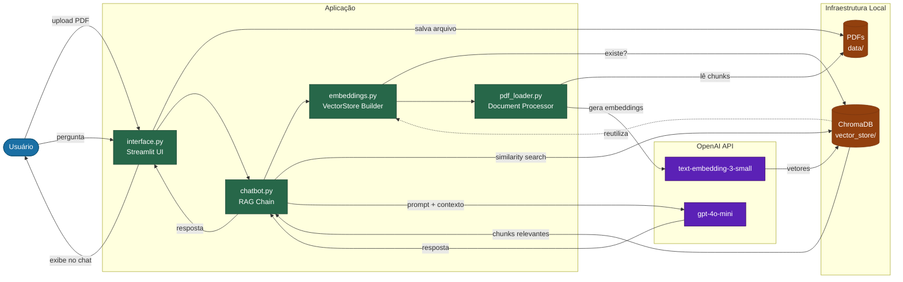

# Arquitetura — Chatbot RAG com Processamento de PDFs

## Diagrama de Componentes e Fluxo de Dados

## Legenda de Cores

| Cor | Camada |
| --- | --- |
| Azul | Usuário |
| Verde | Aplicação (módulos Python) |
| Laranja | Infraestrutura local (disco) |
| Roxo | OpenAI API (nuvem) |
