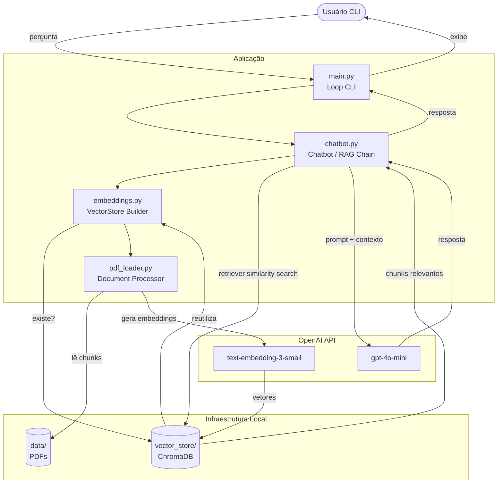

# Arquitetura — Chatbot RAG com Processamento de PDFs

## Diagrama de Componentes e Fluxo de Dados

```mermaid
flowchart TD
    User([Usuário CLI]) -->|pergunta| Main

    subgraph app["Aplicação"]
        Main["main.py\nLoop CLI"]
        Chatbot["chatbot.py\nChatbot / RAG Chain"]
        Embeddings["embeddings.py\nVectorStore Builder"]
        PDFLoader["pdf_loader.py\nDocument Processor"]
    end

    subgraph infra["Infraestrutura Local"]
        VectorStore[("vector_store/\nChromaDB")]
        DataDir[("data/\nPDFs")]
    end

    subgraph openai["OpenAI API"]
        EmbeddingsAPI["text-embedding-3-small"]
        LLM["gpt-4o-mini"]
    end

    Main --> Chatbot
    Chatbot --> Embeddings
    Embeddings -->|"existe?"| VectorStore
    VectorStore -->|"reutiliza"| Embeddings
    Embeddings --> PDFLoader
    PDFLoader -->|"lê chunks"| DataDir
    PDFLoader -->|"gera embeddings"| EmbeddingsAPI
    EmbeddingsAPI -->|"vetores"| VectorStore

    Chatbot -->|"retriever similarity search"| VectorStore
    VectorStore -->|"chunks relevantes"| Chatbot
    Chatbot -->|"prompt + contexto"| LLM
    LLM -->|"resposta"| Chatbot
    Chatbot -->|"resposta"| Main
    Main -->|"exibe"| User
```
